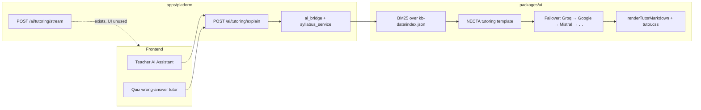
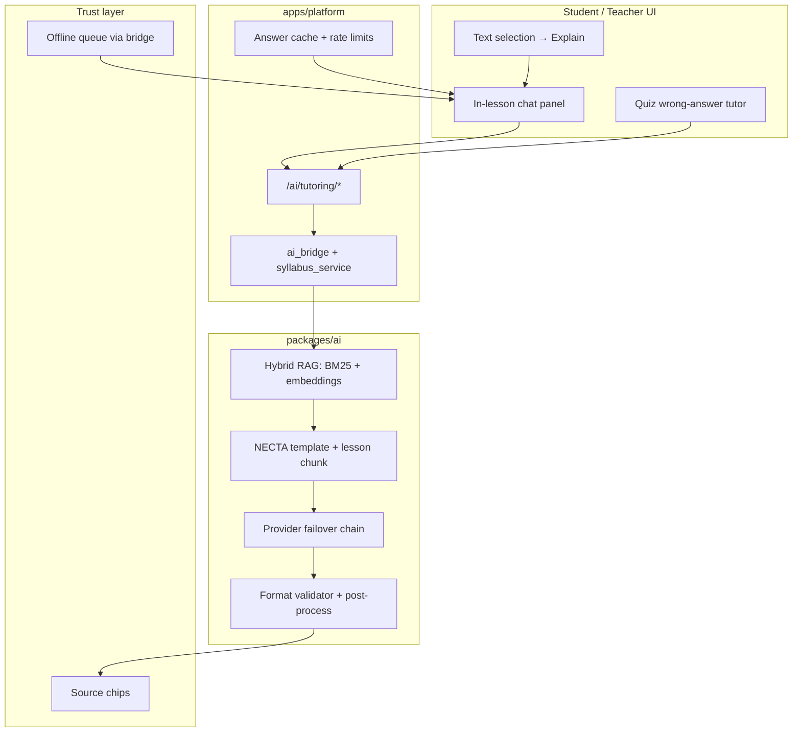

# Casuya AI Tutor — Product & Engineering Roadmap

**Author:** Engineering plan (2026-09-20)  
**Status:** Phase 1–5 shipped (2026-09-20); hybrid RAG + embeddings, review queue, server threads, translate streaming  
**Legend:** `[x]` done · `[~]` partial · `[ ]` not started  
**Related:**
- [`ai-connectivity-plan.md`](./ai-connectivity-plan.md) — provider health, bridge, fallbacks
- [`packages/ai/docs/tutoring-ui-spec.md`](../../packages/ai/docs/tutoring-ui-spec.md) — visual style for tutor responses
- [`packages/ai/docs/system-prompt-v2.md`](../../packages/ai/docs/system-prompt-v2.md) — NECTA prompt templates
- [`performance-optimization-plan.md`](./performance-optimization-plan.md) — bundle splitting, lazy load

---

## 0.5 Implementation status (live tracker)

Updated when AI tutor work lands. **Committed and deployed to production.**

### Surface scorecard (A+ target)

| Surface | Grade | Notes |
|---------|-------|-------|
| Teacher AI tutor | **A+** | Streaming, chips, format chip, listen, teacher prefs |
| Student Uliza AI | **A+** | Bottom sheet, threads, selection explain, follow-up chips, helpful rating |
| In-lesson quiz tutor | **A+** | `mountLessonQuizTutor`, lesson context, listen |
| Exam-style quiz tutor | **A+** | Full quiz text context via `buildQuizLessonContent` |
| Question gen (teacher/admin) | **A+** | `runAiGenerateTask` + KB chips |
| Test generator | **A+** | Unified `renderAiResultFooter` |
| Translate | **A+** | Streaming translate + listen + `/explain` fallback |
| Lesson plans / scheme | **A** | Source badge + TIE syllabus chip |

### Repo / ops (still open)

- [x] Git commit + push of all AI tutor changes
- [x] Deploy Railway (backend) + Vercel/static (frontend)
- [x] Production smoke script incl. tutor stream (`scripts/smoke-production.ps1`)
- [x] E2E test: student lesson → ask AI → NECTA tip visible (`e2e/lesson-ai.spec.ts`)
- [x] E2E: 360px viewport + dark mode (`e2e/ai-tutor-phase5.spec.ts`)
- [x] E2E Slow 3G emulation + first paint < 2.5s (`ai-tutor-phase5.spec.ts`)
- [~] Manual QA: real device 3G spot-check (optional)
- [x] Roadmap checkboxes synced with code (this section)

### Key files (implemented)

| Layer | Path |
|-------|------|
| Shared tutor UI | `apps/platform/frontend/assets/js/modules/ai/tutor-panel.js` |
| Student chat | `apps/platform/frontend/assets/js/modules/student/ai-chat.js` |
| Selection bridge | `apps/platform/frontend/assets/js/modules/lesson/lesson-content.js` |
| Platform API | `apps/platform/backend/api/ai.py` |
| Format + retry | `packages/ai/src/tutoring/post-process.ts`, `packages/ai/routes/tutoring.ts` |
| Styles | `apps/platform/frontend/assets/css/tutor.css` |

---

## 0. Executive summary

### North star

A student on a low-end Android phone, on 2G/3G, opens a lesson, asks a question in Swahili or English, and receives a **fast, exam-correct, beautifully formatted** answer grounded in **TIE syllabus + NECTA past papers** — even when the network is weak.

### Problem today

| Symptom | Root cause |
|---------|------------|
| Students rarely use AI | No in-lesson chat; AI only appears after wrong quiz answers |
| Answers feel slow | UI waits for full response; streaming API exists but is unused |
| Answers feel generic | Lesson context often missing; teacher must paste HTML manually |
| Hard to trust | KB hits returned but not shown; no source chips |
| Format drift | Model sometimes skips NECTA tip / Tanzania blockquote sections |
| Paraphrased questions miss KB | BM25 keyword search only; no semantic retrieval |
| “Streaming” feels fake | Backend chunks full response by sentence after LLM completes |

### Target outcome

- **Every student** can ask AI inside any lesson (`Uliza AI` bottom sheet).
- **First visible text** in under 2 seconds on 3G (streaming + skeleton UI).
- **> 90%** of answers include all six mandatory NECTA sections.
- **Source chips** show syllabus topic + NECTA paper references.
- **Offline path**: cached answers + KB snippet fallback when LLM unavailable.
- **Swahili-first** toggle for Form I–II students.

### Non-goals (this roadmap)

- Replacing human teachers or marking official NECTA exams
- General-purpose open chat unrelated to curriculum
- Paid-only provider lock-in (keep free-chain failover)
- Vector DB infrastructure in Phase 1 (hybrid RAG is Phase 3)

---

## 1. Current architecture (baseline)

### Key files (reference)

| Layer | Path |
|-------|------|
| Teacher UI | `apps/platform/frontend/assets/js/modules/teacher/ai-assistant.js` |
| Quiz tutor | `apps/platform/frontend/assets/js/modules/api-quiz.js` |
| Markdown renderer | `apps/platform/frontend/assets/js/modules/api-client/core/markdown.js` |
| Streaming client | `apps/platform/frontend/assets/js/modules/api-client/core/fetch.js` |
| Tutor styles | `apps/platform/frontend/assets/css/tutor.css` |
| Platform API | `apps/platform/backend/api/ai.py` |
| AI bridge | `apps/platform/backend/services/ai_bridge/` |
| Tutoring engine | `packages/ai/src/tutoring/tutoring-engine.ts` |
| NECTA prompt | `packages/ai/src/prompts/necta/tutoring.ts` |
| KB search | `packages/ai/src/kb/knowledge-base.ts` |
| Provider chain | `packages/ai/src/providers/free-chain.ts` |
| Lesson viewer | `apps/platform/frontend/assets/js/modules/student/lessons/viewer.js` |

---

## 2. Gap analysis

| Area | Today | Target |
|------|-------|--------|
| **Audience** | Teachers + post-quiz students | All students, in-lesson |
| **UX pattern** | Form → wait → card | Chat panel, streaming, voice |
| **Context** | Manual paste / quiz-only | Auto: subject, form, lesson HTML, subtopic |
| **Trust** | “Powered by AI” badge | Source chips + offline/cached states |
| **Format** | Prompt-only enforcement | Post-process validator + 1 retry |
| **Retrieval** | BM25 keyword | Hybrid BM25 + embeddings (Phase 3) |
| **Streaming** | Sentence-chunk after full gen | Real token stream where supported |
| **Offline** | KB snippets when LLM down | IndexedDB cache + question queue |
| **Language** | English-biased default | Swahili / English / both toggle |
| **Follow-up** | Single-shot Q&A | Short conversation thread (4 turns) |

---

## 3. Target architecture (end state)

---

## 4. Phased delivery

### Phase 1 — Quick wins (1–2 weeks)

**Goal:** Better answers and faster feel without new major UI surfaces.

#### 1.1 Wire streaming into tutor UIs

- [x] Create shared `modules/ai/tutor-panel.js` (loading state, stream handler, final render)
- [x] Switch teacher assistant + quiz tutor from blocking `/explain` to `streamTutorResponse()`
- [x] Fall back to `/explain` on stream failure
- [x] Debounced `renderMath()` during incremental markdown render
- [x] Streaming skeleton placeholders while waiting (`renderTutorStreamingSkeleton`)

**Files:** `fetch.js`, `ai-assistant.js`, `api-quiz.js`, new `modules/ai/tutor-panel.js`

#### 1.2 Source / trust chips

- [x] Render `kbHits` as chips under answer (NECTA paper, TIE unit, lesson ref)
- [x] Extend `ai-source-badge.js`: `AI + syllabus` | `Offline notes` | `Cached` (24h server cache wired)

**Files:** `api-quiz.js`, `ai-source-badge.js`, `markdown.js`

#### 1.3 Auto-fill context

- [x] Pass `lesson_id`, `subtopic`, `topic`, first ~2k chars of lesson HTML automatically
- [x] Teacher assistant: default subject/form from profile or last lesson (`/teachers/me` + localStorage)
- [x] Quiz tutor: enrich payload from `/lessons/{id}/package` metadata (package API + `__casuyaQuizLessonMeta`)

**Files:** `ai_bridge/prompts.py`, `api-quiz.js`, `ai-assistant.js`

#### 1.4 NECTA format enforcement

- [x] Extend `post-process.ts` to detect missing mandatory sections (`scoreNectaFormatCompliance`)
- [x] Inject placeholders or trigger one regeneration retry (AI service + platform bridge)
- [x] Log format compliance score for ops (`logger.info` on backend; admin dashboard still TODO)

**Files:** `packages/ai/src/tutoring/post-process.ts`, `prompts/necta/tutoring.ts`

**Phase 1 exit criteria:**
- Streaming works on teacher + quiz surfaces
- Every answer shows at least one source chip when KB hit exists
- Quiz tutor sends lesson context without manual input

---

### Phase 2 — Student experience (2–4 weeks)

**Goal:** Google/Claude-style tutoring inside the lesson viewer.

#### 2.1 In-lesson “Ask AI” panel (P0)

- [x] Floating **Uliza AI** button on lesson viewer
- [x] Mobile bottom sheet (360px min, 44px touch targets)
- [x] Auto-fill: subject, form, lesson title, subtopic from open lesson
- [x] Suggested prompts: *Eleza kwa Kiswahili*, *NECTA huuliza vipi?*, *Toa mfano wa Tanzania*
- [x] Voice in: `casuya-record`; voice out: `casuyaAttachListen`
- [x] Lazy-load via `student.extras.bundle.js` + dedicated `student-ai-chat.js` chunk from viewer

**Files:** `lessons/viewer.js`, new `modules/student/ai-chat.js`, `student.extras.bundle.js`

#### 2.2 “Explain this” text selection

- [x] Bridge script posts selected text + surrounding paragraph to parent (`casuya-selection`)
- [x] Parent opens chat pre-filled with selection (`openLessonAiChatExplain`)
- [x] Payload: `{ selected_text, surrounding_context, lesson_id }` (via `buildLessonTutorPayload` + `lesson_id` API field)

**Files:** `lesson-content.js`, `student/ai-chat.js`

#### 2.3 Short conversation threads

- [x] Client: last 4 turns in sessionStorage
- [x] API: accept `messages[]`; trim to token budget server-side (`_append_thread_context`, 4k cap)
- [x] UI: student bubble + tutor `.tutor-response` card per turn

**Files:** `ai.py`, `tutoring-engine.ts`, `student/ai-chat.js`

#### 2.4 Swahili-first toggle

- [x] Chat header toggle: `sw` | `en` | `both` (default `both` for Form I–II)
- [x] Prompt variant in `packages/ai/src/tutoring/prompts.ts` (`language` → Kiswahili/English/both hints)
- [x] Persist preference in localStorage

**Phase 2 exit criteria:**
- Students can ask ≥1 question per lesson session without leaving viewer
- Follow-up “explain simpler” works in same thread
- Swahili direct answer when toggle set to `sw`

---

### Phase 3 — Answer quality (3–5 weeks)

**Goal:** Answers that reliably match Tanzanian exam reality.

#### 3.1 Hybrid RAG

- [x] Phase A: query expansion (Swahili ↔ English syllabus synonyms) — `query-expansion.ts`
- [x] Phase B: hybrid merge BM25 + metadata similarity (+ optional `embeddings.json`) — `hybrid-search.ts`
- [x] Filter by `subject_slug`, `form_level`, `doc_type` (via `SearchOptions.kind` + metadata filters)

**Files:** `packages/ai/src/kb/search.ts`, index rebuild script

#### 3.2 Lesson-aware chunking

- [x] Chunk lesson HTML by headings when `lesson_id` present — `lesson-chunk.ts`
- [x] Prefer lesson chunk over generic KB when similarity high (chunk injected into RAG context)

**Files:** `reader.py`, new chunker in `packages/ai`

#### 3.3 Provider tiers

| Tier | Provider | Use case |
|------|----------|----------|
| Fast | Groq / Gemini Flash | Default student questions |
| Quality | Claude 3.5 Sonnet | Teacher deep explain (`mode: deep`) |
| Offline | KB snippets | No network |

- [x] Add Anthropic quality provider behind `ANTHROPIC_API_KEY` / `CASUYA_AI_QUALITY_PROVIDER=anthropic`
- [x] Route by `mode: explain | deep | quiz-gen` (platform `TutoringRequest.mode`)

**Files:** `free-chain.ts`, `provider-factory.ts`

#### 3.4 Real LLM token streaming

- [x] Provider streaming API in `TutoringEngine` (`tutorStream`)
- [x] SSE pass-through in `ai.py` + `/api/tutoring/stream` in casuya-ai
- [x] Sentence-chunk fallback for cached answers + `/explain` fallback in UI

#### 3.5 Answer validation

- [x] Cross-check TIE terms against syllabus JSON for subtopic — `answer-validation.ts`
- [x] Uncertainty phrasing: *Thibitisha na kitabu chako* (auto footer when flagged)
- [x] Teacher review queue for flagged answers (`tutor_review_items` + Admin → AI Tutor approve/dismiss)

**Phase 3 exit criteria:**
- Paraphrased Swahili questions retrieve relevant syllabus docs
- > 90% format compliance (six NECTA sections)
- Quality tier available for teachers

---

### Phase 4 — Offline, performance, scale (ongoing)

#### 4.1 Offline & low bandwidth

- [x] Cache last 20 Q&A per student in IndexedDB (`tutor-qa-idb.js`)
- [x] Queue questions offline; sync when online — `tutor-qa-queue.js`
- [x] Prefetch suggested questions from lesson headings on Wi‑Fi (heading chips in `ai-chat.js`)
- [x] Cap `lesson_context` at 4k chars

#### 4.2 Lazy loading

- [x] AI chat in `student.extras.bundle.js` only
- [x] Load KaTeX when tutor panel opens (`ensureKaTeX` in `runTutorQuery`)
- [x] Never block lesson iframe on AI scripts (lazy load)

#### 4.3 Cost & abuse controls

- [x] Rate limit: 30 questions/student/day (teachers unlimited)
- [x] Server cache: identical `(question_hash + lesson_id)` for 24h
- [x] Admin usage dashboard — Admin → **AI Tutor** (`/ai/quality`)

#### 4.4 Observability

- [x] Log: provider, latency, kb hit count, format score (`tutor_telemetry.py` + casuya-ai logs)
- [x] Admin “AI quality” page: samples, failures, offline rate

---

## 5. UI specification alignment

Reference: [`packages/ai/docs/tutoring-ui-spec.md`](../../packages/ai/docs/tutoring-ui-spec.md)

| Component | CSS class | Action |
|-----------|-----------|--------|
| NECTA tip callout | `.tutor-necta-tip` | Use on all surfaces |
| Tanzania context | `.tutor-context-blockquote` | Enforce `>` in post-process |
| Flow diagram | `.tutor-code-block` | Processes / chains |
| Loading | `.tutor-thinking` | Add to streaming chat |
| Response container | `.tutor-response` | Wrap all tutor HTML |
| Mobile tables | responsive rules in `tutor.css` | Test at 360px |
| Follow-up chips | spec § Follow-up Action Chips | Add to chat footer |
| Review question card | spec § Review Question Card | Toggle marking scheme |

### New UI components to build

- [x] Streaming skeleton (section placeholders before content arrives)
- [x] Source citation row (chips)
- [x] “Was this helpful?” thumbs up/down (sessionStorage feedback log)
- [x] Chat bottom sheet (student lesson viewer)
- [x] Follow-up action chips (`attachTutorFollowUp`)
- [x] Review question card + marking-scheme toggle (`renderTutorMarkdown` + `bindTutorMarkdownInteractions`)

---

## 6. Prioritized backlog

| Priority | Item | Effort | Impact | Phase |
|----------|------|--------|--------|-------|
| **P0** | In-lesson student chat panel | M | ★★★★★ | 2 |
| **P0** | Wire streaming + thinking state | S | ★★★★☆ | 1 |
| **P0** | Auto lesson context + metadata | S | ★★★★☆ | 1 |
| **P1** | Source / trust chips | S | ★★★★☆ | 1 |
| **P1** | Text selection “Explain” | M | ★★★★☆ | 2 |
| **P1** | Post-process format enforcement | M | ★★★★☆ | 1 |
| **P2** | Conversation threads | M | ★★★☆☆ | 2 |
| **P2** | Swahili-first toggle | S | ★★★★☆ | 2 |
| **P2** | Hybrid RAG | L | ★★★★☆ | 3 |
| **P3** | Real LLM token streaming | M | ★★★☆☆ | 3 |
| **P3** | Offline Q&A cache + queue | L | ★★★★★ | 4 |
| **P3** | Claude quality tier | S | ★★★☆☆ | 3 |

*Effort: S = small (1–3 days), M = medium (1–2 weeks), L = large (2+ weeks)*

---

## 7. Success metrics

| Metric | Baseline | Target |
|--------|----------|--------|
| Time to first visible text | ~5–15s | < 2s on 3G |
| Answers with all 6 NECTA sections | Unknown | > 90% |
| Student “helpful” rating | N/A | > 80% |
| In-lesson chat usage | 0 | ≥ 1 question / lesson session (avg) |
| Quiz → tutor engagement | Partial | > 50% of wrong answers |
| Offline usable rate | KB fallback only | Cache hit or KB when no LLM |
| AI-related support tickets | — | Decrease month-over-month |

---

## 8. Recommended first PR

**Title:** `feat: student in-lesson AI chat (MVP)`

**Scope (single focused PR):**

1. Add `modules/student/ai-chat.js` — bottom sheet + streaming
2. Hook into `lessons/viewer.js` with auto-passed lesson metadata
3. Reuse `renderTutorMarkdown`, `tutor.css`, `streamTutorResponse`
4. Show KB source chips + offline badge
5. Lazy-load via `student.extras.bundle.js`

**Out of scope for first PR:** hybrid RAG, real token streaming, offline queue, Claude tier.

---

## 9. Testing plan

| Area | Tests |
|------|-------|
| API | Pytest: empty progress-style patterns for tutoring; format post-process unit tests |
| AI package | Jest: `post-process.ts`, KB search with Swahili queries |
| Frontend | E2E: 360px viewport, dark mode, admin review queue, translate stream |
| E2E | Student opens lesson → asks question → sees NECTA tip + context blockquote |
| Offline | Disable AI service → verify KB fallback + badge |
| Accessibility | Voice in/out, 44px touch targets, screen reader on chat |

---

## 10. Rollout

1. **Internal** — teachers + demo students on staging
2. **Pilot** — one school, Form I Chemistry + Mathematics
3. **Measure** — format compliance, latency, helpful ratings
4. **Iterate** — Phase 1 quick wins if chat MVP ships first
5. **General availability** — all published lessons

---

## 11. Open decisions

| Decision | Options | Recommendation |
|----------|---------|----------------|
| Chat placement | Bottom sheet vs sidebar | Bottom sheet (mobile-first) |
| Default language | English vs both | `both` for Form I–II |
| Rate limit | 20 vs 30 vs unlimited teachers | 30/student/day |
| Claude in prod | Yes/no | Yes, teacher `deep` mode only |
| Conversation storage | Client-only vs server | **Shipped:** sessionStorage + server sync (`tutor_threads`) |

---

---

## 12. Phase 5 — QA & maturity (shipped 2026-09-20)

### 5A — Automated QA

- [x] Playwright: 360px mobile viewport + 44px FAB touch target
- [x] Playwright: dark mode (`data-theme=dark`)
- [x] Playwright: admin review queue approve/dismiss
- [x] Playwright: teacher translate streaming

### 5B — Quality hardening

- [x] Optional query embeddings at runtime (`query-embed.ts`) + `build-kb-embed` script
- [x] CI verify + weekly GitHub Action to build/commit `embeddings.json` (`.github/workflows/build-kb-embeddings.yml`)
- [x] Persistent review queue (`tutor_review_items`) enqueued on `needsReview`
- [x] Admin AI Tutor page: pending queue with Approve / Dismiss

### 5C — Platform maturity

- [x] Server-side tutor threads (`GET/PUT /ai/tutor/thread/{lesson_id}`)
- [x] Student chat loads server thread on mount (`loadTutorThreadFromServer`)
- [x] Translate streaming (`POST /ai/content/translate/stream`)

*Last updated: 2026-09-20 (Phase 5 complete)*
